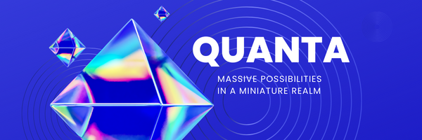

# Quanta for Minecraft 1.19 #

Quanta is a Minecraft Forge Mod featuring a plethora of tech-based machines
inspired loosely by the idea of quantum mechanics. Quanta aspires to be a challenging
yet rewarding mod with nearly endless possibilities.

After versing yourself into the mod you can obtain such luxuries as
resource duplication using FE (Forge energy), ore and material location,
and even efficient teleportation.

Discover the limitless possibilities by playing Quanta today.

# Authors #
Razen

# Acknowledgments #
Mekanism - tons of referencing and inspiration.

